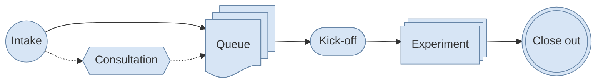



Experimentation is our core service. Whether you're validating a new idea, testing a technology, or running a proof of concept, we offer three service models to match your team's needs and capacity: **Managed**, **Delegated**, and **Full-Service**. Each gives you access to secure, government-compliant cloud environments — the difference lies in how much support we provide and how costs are handled.

Experiments typically run between **3 and 12 months**, giving your team enough time to test, learn, and draw meaningful conclusions.

## Experiment Lifecycle

Below is a very high-level overview of the typical experiment lifecycle. To read more about this process, please visit the [Client Journey]() page.

The process starts when you complete our [intake form](https://ltpms-sgpel.science.cloud-nuage.canada.ca/app/scie-p-intake#/welcome/english). We review your request to determine whether the experiment is a good fit for our service and may schedule a consultation to clarify your needs, goals, and preferred service model. If we have the capacity to begin right away, we will move ahead with the next steps. Otherwise, we will place your request in the queue and provide an estimated start date.

When your experiment is ready to begin, we hold a kickoff meeting to review the terms and conditions, confirm the experiment's scope and requirements, and select the cloud service provider (CSP). We then create the cloud environment, determine who needs access, and agree on who should participate in recurring meetings. Throughout the experiment, we hold regular touchpoints to review progress, address questions, and adjust the work as needed.

At close-out, you complete our Lessons Learned survey and provide an Executive Summary describing the experiment's results and key findings. We then decommission the cloud environment and, where appropriate, discuss next steps such as winding down the work or pursuing a path to production.

## Funding

How you pay for your experiment depends on the service model:

- **Managed** — Generally centrally funded for smaller experiments. If your expected cloud spend is significant, a cost-recovery arrangement may apply.
- **Delegated** — Cost-recovery. Your department covers the cloud costs associated with your experiment.
- **Full-Service** — Cost-recovery. You bring the budget; we deliver the work.

## Service Models

Because every organization is unique, we feel that there's value in offering different levels of autonomy when it comes to managing the lifecycle of experiments. Most of our experiments are run via the Managed model, but we're seeing increased interest in

### Managed

In the Managed model, we handle the heavy lifting so you don't have to. Think of us as your cloud landlord — we set up the building, maintain the plumbing, and make sure the fire exits are clearly marked. You get your own space to work in, without having to worry about what's going on behind the walls.

Here's what that looks like in practice:

- **Your own dedicated environment.** You receive your own subscription, account, or project (depending on the cloud provider) that is isolated from other teams. What you build there is yours to control.
- **We manage the platform for you.** That means handling administration, security configurations, guardrails, and policies. We make sure the environment meets government standards so that you can focus on your experiment — not on compliance paperwork.
- **A cloud expert in your corner.** We assign you a dedicated cloud expert who can guide you through your journey, answer your questions, and help you avoid common pitfalls. You're not alone in this.
- **Full visibility into your spending.** Cloud costs can add up quickly if you're not paying attention. We give you clear, up-to-date information on what you're spending and why — keeping you informed and in control from a FinOps (financial operations) perspective. This applies whether you're using centrally funded resources or bringing your own budget to the table.
- **Access to the full cloud catalogue.** Through our agreements with Google Cloud (GCP), Amazon Web Services (AWS), and Microsoft Azure, you get access to almost any service each provider offers — without having to navigate Government of Canada procurement processes or security assessments yourself. We've already done that work, so you can start using the services you need right away.

### Delegated

In the Delegated model, your department takes on a more active role in supporting its own cloud experimenters. Rather than relying solely on our central team, a designated Subject Matter Expert (SME) within your department works alongside us to help your teams succeed.

Here's what that means for you:

- **A familiar face closer to home.** Your delegated SME understands your department's context, priorities, and constraints. They can help you navigate the financial side of cloud experimentation, chart a path toward production, and connect you with the right people — whether that's within your department or across government — to unlock learning and innovation.
- **Better innovation from within.** Having a delegated SME means your department builds its own cloud expertise over time. That knowledge doesn't disappear when a project ends — it stays in your team and benefits future initiatives.

If you're interested in becoming a delegated department or SME, please [contact us](). We'd love to work with you in order to see how we can help.

### Full-Service

Have a complex application or service you need to build or experiment with, but don't have the in-house resources or bandwidth to make it happen? The Full-Service model is designed for exactly that. You bring us the funding and the requirements, and our development experts take care of the rest, from architecture and implementation to deployment and iteration.

This option is ideal for teams with a clear problem to solve but limited technical capacity to tackle it on their own. We work with you to understand what you need, and then we build it.

> Before submitting an intake request for a **Full-Service** experiment, please [reach out to us]() directly. Our internal capacity is limited, and we want to make sure we can give your project the attention it deserves before committing to it.


Add a RACI table showing who is Responsible, Accountable, Consulted, and Informed for key activities (e.g. environment setup, security, billing, support) across the Managed, Delegated, and Full-Service models.

